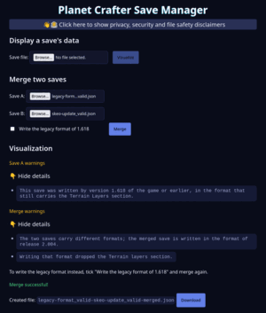
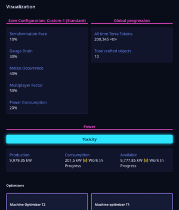

<div align="center" width="100%">
<div>
  
# Planet Crafter Save Tools
</div>
</div>

<div align="center" width="100%">
<div>

  
  [](https://planet-crafter-save-manager.netlify.app/)
[](https://app.netlify.com/projects/planet-crafter-save-manager/deploys)
[](https://github.com/delairec/planet-crafter-save-tools/actions/workflows/site-check.yml?query=branch%3Amaster)
[](LICENSE)

  [](https://github.com/delairec/planet-crafter-save-tools/actions/workflows/quality.yml?query=branch%3Amaster)
[](https://github.com/delairec/planet-crafter-save-tools/actions/workflows/dependencies.yml?query=branch%3Amaster)
[](https://github.com/delairec/planet-crafter-save-tools/actions/workflows/dependabot/dependabot-updates?query=branch%3Amaster)
[](https://github.com/delairec/planet-crafter-save-tools/actions/workflows/ui-tests.yml?query=branch%3Amaster)
[](https://github.com/delairec/planet-crafter-save-tools/actions/workflows/release.yml)
</div>
</div>

> ❗ I’m not actively maintaining this project (or only minimally). If you’d like to add improvements or fix bugs,
> feel free to fork it 😃

<div align="center" width="100%">
<div>

  ## [Open the Save Manager in browser](https://planet-crafter-save-manager.netlify.app/) — nothing to install

<p>
  <a href="docs/assets/welcome-page-dark.png"><picture>
    <source media="(prefers-color-scheme: light)" srcset="docs/assets/welcome-page-light-thumbnail.png">
    
  </picture></a>
  <a href="docs/assets/display-page-dark.png"><picture>
    <source media="(prefers-color-scheme: light)" srcset="docs/assets/display-page-light-thumbnail.png">
    
  </picture></a>
</p>
<p><sub>Open a screenshot at full size, or see the <a href="docs/assets/welcome-page-light.png">merge in the light theme</a>
and the <a href="docs/assets/display-page-light.png">save view in the light theme</a>.</sub></p>
</div>
</div>

## What you can do

- **Merge two saves** into one world, ready to load in the game — pick which format to write when the two saves
  come from different game versions.
- **Look inside a save**: progression, terraformation levels, players, energy balance, world settings.
- **Check a save** against the game's format, and see exactly which part is wrong when it is not.

**Your saves stay on your computer.** Everything runs in your browser: the page never sends a save anywhere.

### Coming next

- Editing a save, beyond viewing it.
- Recovering what can be saved from a corrupted file.

## How to merge two worlds

1. Find your saves. On Windows they sit in `%APPDATA%\..\LocalLow\MijuGames\Planet Crafter\`.
2. Open the [Save Manager](https://planet-crafter-save-manager.netlify.app/), pick the two files and press
   **Merge**.
3. Download the merged save, copy it next to the others, and pick it in the game.

The original saves are never modified.

## Prefer the command line?

The same merge runs from a clone of this repository, on as many pairs of saves as you like in one go. With
[Bun](https://bun.sh) installed:

```
bun install
bun merge
```

Put each pair in its own folder under `input/` — the folder name becomes the name of the merged world — and collect
the results in `output/`:

```
input/
└── Toxiprime/          ← name of the merged world
    ├── Standard-1.json
    └── Standard-3.json
```

Arguments, exit codes and Node.js support are described in [Command-line tools](docs/wiki/command-line.md).

## Going further

| Page                                             | For                                                                             |
|--------------------------------------------------|---------------------------------------------------------------------------------|
| [Command-line tools](docs/wiki/command-line.md)  | every argument, exit code and output of `bun merge` and `bun validate`          |
| [Save format](docs/save-format.md)               | the curious: how the game writes a save, section by section                     |
| [Energy levels](docs/energy-levels.md)           | how the Save Manager computes the energy balance                                |
| [Architecture](docs/wiki/architecture.md)        | contributors: the packages of the workspace and what each may depend on         |
| [Development](docs/wiki/development.md)          | contributors: tests, type checks, audits, quality gate, UI commands             |
| [Releases and production](docs/wiki/releases.md) | maintainers: versions, cutting a release, publishing the web UI                 |

Each tool carries its own version, listed in its `CHANGELOG.md`. Netlify publishes no production deploy by itself:
production is published by hand from a `ui-save-manager-v*` tag, and the deploy previews stay public.

## Under the hood: how the merge decides

> **[`docs/awawa-project-specification/rules.awawa`](./docs/awawa-project-specification/rules.awawa) is the single
> source of truth for every merge decision.** Each entity states the conflict it settles (`CONFLICT`), how it settles
> it (`RESOLUTION`), one falsifiable obligation per `SPEC`, and the test that proves each one (`ATTESTED_BY`). The
> file is plain text and reads as it is; `awawa show @RULE.<Name> docs/` prints one entity, `awawa context
> @SECTION.<Name> docs/` every rule that constrains one section. This README deliberately does not restate the
> rules: a second copy would drift from the implementation.

The original saves are never modified; the merged result is written to a separate output folder.

| Topic                       | Rule                                                      |
|-----------------------------|-----------------------------------------------------------|
| Which save is A, which is B | `@RULE.TheSaveOnPrimeBecomesSaveA`                        |
| Global metadata             | `@RULE.GlobalMetadataIsSummedAndUnioned`                  |
| Terraformation levels       | `@RULE.TerraformationLevelsTakeTheHigherValue`            |
| Players                     | `@RULE.PlayersAreDeduplicatedByName`                      |
| World objects               | `@RULE.WorldObjectsAreDeduplicatedByPlanetAndPosition`    |
| Inventories & equipment     | `@RULE.InventoriesAreKeptUnlessTheirOwnerIsEjected`       |
| Statistics                  | `@RULE.StatisticsAreSummed`                               |
| Messages / mailbox          | `@RULE.MailboxMessagesAreDeduplicatedByStringId`          |
| Story events                | `@RULE.StoryEventsAreUnioned`                             |
| Save configuration          | `@RULE.SaveConfigurationComesFromSaveA`                   |
| World events                | `@RULE.WorldEventsAreDeduplicatedByPlanetSeedAndPosition` |
| Shared id numbering space   | `@RULE.IdentifiersAreSharedByInventoriesAndWorldObjects`  |
| Duplicated ids across saves | `@RULE.DuplicateIdentifiersAreRemappedOnTheSaveBSide`     |
| Player identifiers          | `@RULE.APlayerIdentifierIsCarriedAsExactDecimalText`      |
