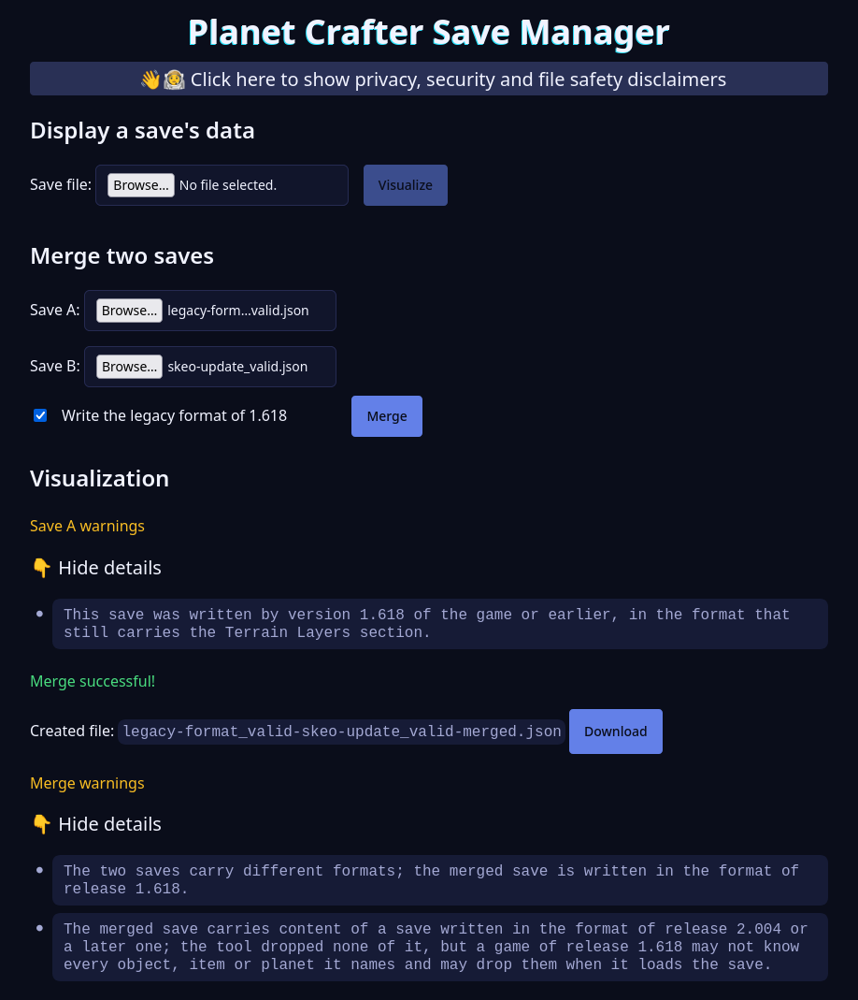

# Planet Crafter Save Tools

> ❗ I’m not going to actively maintain this project (or only minimally). If you’d like to add improvements or fix bugs,
> feel free to fork it
> 😃

## Overview

This project provides tools to manipulate save files from **The Planet Crafter**. Currently, the available tools are:

- **Merger**: combine two save files into one, following specific rules to preserve as much information as possible.
- **Validator**: check if a save file is correctly formatted according to the game's specifications.

In progress:

- **Save Manager**: a UI to visualize save files. In the long term, it could also include editing capabilities, but for
  now it is only a viewer.

Planned:

- **Fix corrupted saves**: a tool to attempt to recover data from corrupted save files thanks to analysis.



## Project Structure

This is a Bun workspace monorepo, organized around package prefixes:

| Package                  | Role                                                                                                                                 |
|--------------------------|--------------------------------------------------------------------------------------------------------------------------------------|
| `shared-save-processing` | Save file wire format: types, parsing, serialization and JSON schemas.                                                               |
| `shared-platforms`       | Runtime platform adapters (filesystem/process) for Bun and Node, and the reading of `--name=value` arguments.                        |
| `util-types`             | `RuntimePlatform` contract type, consumed (type-only) by `shared-platforms`.                                                         |
| `core-mapping`           | Merge and validation engines organized in Clean Architecture layers to be reusable accross multiple different frontends (CLIs, UIs). |
| `cli-merge`              | Thin CLI: parses `--input`/`--output` arguments and delegates to `core-mapping`.                                                     |
| `cli-validate`           | Thin CLI: parses `--file` argument and delegates to `core-mapping`.                                                                  |
| `ui-save-manager`        | SolidStart UI to visualize save files, consuming `core-mapping` controllers.                                                         |

The prefix of a package name sets what it is allowed to depend on. A type-only import counts as a dependency.

| Prefix     | May depend on                  |
|------------|--------------------------------|
| `util-*`   | nothing                        |
| `shared-*` | `util-*`                       |
| `core-*`   | `shared-*`, `util-*`           |
| `cli-*`    | `shared-*`, `util-*`, `core-*` |
| `ui-*`     | `shared-*`, `util-*`, `core-*` |

`bun run check:dependencies` enforces this matrix.

## Merge and Validate tools

Merges two save files from **The Planet Crafter** into a single one, preserving as much information as possible.

### Prerequisites

* Using [Bun](https://bun.sh) by default.
* Minimal compatibility with [Node.js](https://nodejs.org) is supported.

### Installation

```
bun install
```

The install hook `scripts/sync-private-context.sh` clones the private agent context repository when the account has
access to it. Contributors without access get a skip message and an otherwise normal install.

### Scripts

#### With Bun

```
bun merge
```

Generates the merged saves in output directory, by processing all subfolders from input folder.

A folder holding a save file the validation refuses is reported and skipped, the remaining folders are still
processed, and the command exits with code `0`. A merge that runs and produces no usable save file, or a merged save
the output directory refuses, is a different matter: the command names the folder, stops there and exits with a
non-zero code. Code `2` is reserved for an input directory holding no folder to merge.

The save the merge produces is validated in turn, by the same rules as the saves it accepts. What that save does not
pass is named on stderr, folder by folder — never as a defect of one of the input files, since it is the merge that
produced it. This changes nothing else: the file is written where stdout announces it, the command still exits with
code `0`, and the remaining folders are still processed. The merged save is yours to use or to discard, with the
diagnostic in hand.

```
bun merge -- --input=<directory> --output=<directory>
```

Overrides the default `input` and `output` directories.

```
bun validate -- --file=<filepath>
```

Validates a json save file against the json schemas stored in this project. This is useful mostly for debugging.

```
bun merge -- --version
bun validate -- --version
```

Prints the name and the version of the command, and exits with code `0`. Quote that line in a bug report.

Both commands accept `--name=value` arguments only, and act on none they do not know: an argument such as `--inpt=x`,
`--input x` or a bare `--file` is named on stderr with a usage message, and the command exits with code `1` without
reading anything. The value is taken whole, so a path or a directory name may hold an equals sign.

```
bun test
```

```
bun test:watch
```

Execute all the unit tests of the project. Use `watch` to enable automatic run on save.

Mocks and spies are restored between tests by a global `afterEach`, so no test has to clean up after itself. It comes
from `testSetup.ts`, preloaded through the `bunfig.toml` sitting next to it: one at the repository root, one in each
package. Bun resolves `bunfig.toml` from the working directory only, without looking at parent directories, so the
preload silently does not apply when tests are run from any other directory — a deeper folder inside a package, or an
IDE run configuration whose working directory is the folder of the test file.

```
bun test testIsolation.spec.ts
```

Checks that the preload actually applies. Run it with the working directory you want to check (the repository root, a
package folder, an IDE run configuration): it fails when mocks are not restored between tests in that context.

In an IDE, a generated run configuration usually takes the folder of the test file as its working directory, which is
deeper than any `bunfig.toml`. In IntelliJ, set the environment variable below on the Bun *configuration template*
(Run > Edit Configurations > Edit configuration templates…), so that every run configuration created afterwards loads
the setup whatever its working directory:

```
BUN_OPTIONS=--preload=<absolute path>/testSetup.ts
```

`BUN_OPTIONS` prepends CLI arguments to every Bun invocation, and a CLI flag wins over `bunfig.toml`. It applies to run
configurations created after the change only, so delete the temporary ones already generated. It lives in
`.idea/workspace.xml`, which is git-ignored: it is a per-developer setting, not shared and not used by the CI, where
`bunfig.toml` remains the source of truth.

```
bun run lint:types
```

Checks typings in all the project files (using `tsc --noEmit` under the hood). Every package owns a `tsconfig.json`
extending the root one and its own `lint:types` script, which the root script chains over the workspace: each package
is therefore checked as a separate program, with the libraries it is entitled to. Only `ui-*` declares the DOM
libraries, so a browser global referenced from a `core-*` or a `cli-*` package fails the check instead of resolving
silently, and the `.tsx` files of the UI are covered. `ui-save-manager` runs two programs, its own and the one of
`e2e/`, the Playwright types belonging to the scenarios alone.

```
bun run audit
```

Audits production and development dependencies against the GitHub Advisory Database, failing on an advisory of
moderate severity or above. The `Dependencies` workflow runs it on every pull request, on every push to `master` and
once a month on `master`, so an advisory published against an unchanged `bun.lock` fails a run within a month. The two
Picomatch advisories are explicitly allowlisted because `micromatch` still requires the affected 2.x dependency
transitively; they should be removed as soon as that upstream constraint is updated. An allowlisted advisory stays
tied to the corpus: `check:audit-ignores` fails when an `--ignore=` of the script is named by the `SEEN_IN` of no
active `LIMITATION`.

Version bumps are raised on a schedule next to it. `.github/dependabot.yml`, maintained on the default branch because
Dependabot reads its configuration there and nowhere else, opens one grouped pull request per week for the actions the
workflows use and one for the Bun dependencies of the workspace. Both scan the repository root, where the manifest
declares every workspace member and the single `bun.lock` resolves them all. The `bun` ecosystem brings version
updates alone and never opens a security update, so `bun run audit` remains the net against vulnerabilities; the
actions receive their security updates as well. A pull request opened by Dependabot skips the Claude review workflow,
which has no secrets available on such a run.

```
bun run audit:quality
```

Runs `check:guards`, then the [Fallow](https://github.com/fallow-rs/fallow) audit and health reports (dead files,
unused exports, unresolved imports) against `master`. This is the whole gate in one command, for a working copy. The
CI covers the same ground in two jobs, each running the half it is equipped for: `guards` runs `check:guards`, and
`fallow` runs the audit and the health report through the Fallow action, which scopes them to the base of the pull
request and renders them into the run summary.

```
bun run release:verify
```

Runs every check a release must pass on the commit it tags: `lint:types`, `audit:quality`, `bun test`, `test:ui` and
the dependency audit, stopping at the first failure. The `Release` workflow runs it on every version tag pushed — a tag
whose name holds `v` or `@` followed by a digit — and it can be run by hand before tagging. `test:ui` needs the
browsers of `test:ui:install`.

```
bun run check:guards
```

Runs the four guard scripts of this repository — `check:assertions`, `check:fixtures`, `check:dependencies` and
`check:presentation` — which enforce conventions no off-the-shelf linter knows about. They read no git history and take
a fraction of a
second, so they are the half of `audit:quality` to run while writing code.

```
bun run check:assertions
```

Fails on any spec asserting a fabricated boolean (`expect(list.some(...)).toBeTruthy()`, `expect(a > b).toBe(true)`):
a matcher applies to the value itself so that a failure shows the actual data. Boolean matchers stay legitimate on
business booleans such as `expect(player.host).toBe(true)`. Every `*.spec.{js,ts,tsx}` file of the repository is
scanned, outside dependencies and build outputs, and only the outermost asserted expression is read: a comparison
written inside a callback (`expect(list.find(item => item.id === 1)).toBeTruthy()`) builds the asserted value, it is
not the assertion. The check reads one line at a time, so an assertion spread over several lines escapes it.

```
bun run check:fixtures
```

Fails on any spec making a fixture compile instead of typing it: `as unknown`, `as never`, an `any` annotation —
including the JSDoc forms `/** @type {any} */` and `@param {any}`, which a search for `: any` does not see — and
`@ts-ignore`. A test fixture is built by its builder (`packages/shared-save-processing/testing/createSaveRecords.js`
for the save records) so that a record gaining a field breaks the build rather than a test. An input that is illegal
on purpose is declared with `@ts-expect-error`, which fails the day the error disappears, and the check requires that
directive to carry the justification saying which invalidity is under test. String literals are masked before the
line is read, so a forbidden form quoted in a message is not reported; like `check:assertions`, the check reads one
line at a time, so a declaration spread over several lines escapes it.

```
bun run check:dependencies
```

Fails on any breach of the dependency matrix above. It reads the manifest of every workspace package and the package
specifiers imported by its `.js`, `.ts` and `.tsx` sources, then reports a dependency declared on a forbidden prefix,
an import of a forbidden prefix, an import of a workspace package the manifest does not declare, and a declared
workspace dependency that is never imported. A dependency on a library outside the workspace is left to the Fallow
audit. Type-only imports count, JSDoc `@import` directives included, so the check sees what `tsc` erases.

```
bun run check:presentation
```

Fails on any import of `domain/entities/` made from a `presentation/` directory. A presenter receives a value
object, never a domain entity: an entity carries behaviour, so a presenter holding one decides when a domain
computation runs, and its shape follows the save format rather than what is displayed. Infrastructure may still
build entities — that is where a save is read and validated — and the reader port still hands them to the
application layer; only the presentation boundary is closed. Every `.js`, `.ts` and `.tsx` source of every package
is scanned, outside dependencies and build outputs, and type-only and dynamic imports count.

#### Save Manager UI

```
bun run dev:ui
```

Starts the Save Manager UI in development mode.

```
bun run build:ui
```

Builds the UI for production. `bun run preview:ui` builds then serves the result, and `bun run clean:ui` removes the
build output.

```
bun run test:ui:install
```

Downloads the three browser engines the scenario suite drives (Chromium, Firefox and WebKit). Run it once, and again
after a Playwright upgrade. On a machine missing the system libraries the engines need, install them too with
`bunx playwright install --with-deps chromium firefox webkit`, which asks for administrator rights.

```
bun run test:ui
```

Runs the UI scenarios of `packages/ui-save-manager/e2e/` against the production build, on the three engines. Nothing
has to be started beforehand: the suite builds the application, serves it, waits for the port and stops it afterwards.
The save files the scenarios load are generated fixtures versioned next to them, so the suite never depends on the
content of `input/`.

These scenarios are not part of `bun test`, which only collects unit tests: the `*.e2e.ts` suffix keeps the two
runners apart. In the CI they run in their own workflow, on the pull requests targeting `master` and on manual
dispatch — not on the pull requests targeting an integration branch.

#### With Node.js

If you prefer to run the scripts using Node.js instead of Bun, use the following commands:

```
npm run node:merge
```

Node.js counterpart of `bun merge`.

```
npm run node:validate -- --file=<filepath>
```

Node.js counterpart of `bun validate`.

`npm install` works without Bun: the workspace declares nothing npm cannot read. Run it once, then the two
commands only need Node. A `package-lock.json` is yours to keep: the repository ignores it and maintains `bun.lock`
only, and the CI runs under Bun.

Both commands run the same sources as the Bun commands, straight from `packages/`, with no build step: `--import
./scripts/node/register.js` installs
two [module customization hooks](https://nodejs.org/api/module.html#customization-hooks)
that resolve the extensionless relative imports and hand every `.ts` module to esbuild, which removes the
TypeScript syntax Node cannot strip on its own (type-only imports, constructor parameter properties).

Both are covered by execution tests: `packages/cli-validate/cli/validate-cli.node.spec.js` and
`packages/cli-merge/cli/merge-cli.node.spec.js` spawn them as real Node processes on save files generated into a
temporary directory, and assert their output, their exit code and the content of the merged save. They run with
`bun test`, so a command that no longer starts under Node — or that loses the content of a save while still
reporting success — fails the suite instead of reaching a release. Running them needs the Node version
`engines.node` declares.

### Releases

The three tools a user runs carry a version each: `cli-merge`, `cli-validate` and `ui-save-manager`, every package
whose name starts with `cli-` or `ui-`. The other packages are internal and carry none that anyone reads. The web UI
shows its version in the footer.

A tool takes a new version when a commit of `master` since its last version changes its package or a workspace
package it depends on, directly or not: a fix in `core-mapping` raises all three, a fix in `cli-merge` raises that one
only. The Conventional Commits type of the commit sizes the step. The tools are below their first major version:
there, a `!` before the colon raises the minor number and anything else the patch number. Leaving `0` is a decision
written by hand in the `package.json`, never the outcome of a release; from `1.0.0` on, a `!` raises the major
number, a `feat` the minor one, anything else the patch number. Every change reaches `master` through a pull
request, so every commit there carries a checked title.

```
bun run release
```

Run on a branch cut from an up-to-date `master`. For each tool that changed, it raises the `version` of its
`package.json`, adds an entry listing the commits it carries to its `CHANGELOG.md`, and refreshes `bun.lock`. Open
the pull request it names, `chore(release): …`, against `master`.

```
bun run release:tag
git push origin <the tags it names>
```

Run on `master` once the release pull request is merged. It sets an annotated tag `<tool>-v<version>` on that squash
commit for every version no tag names yet.

Netlify publishes no production deploy by itself: it builds every push to `master` and every pull request against
it, and the deploy previews stay public, but production changes only when a deploy is published by hand. Publish the
deploy of the commit a `ui-save-manager-v*` tag names — the squash commit of the release pull request — from the
Netlify dashboard.

### Preparing data

#### 1. Create the `input` folder

Create one sub-folder per desired merge.

> ❗ Each sub-folder must contain **exactly 2 `.json` files**. A sub-folder holding any other number of `.json`
> files is skipped, with a warning on stderr naming it and the number of save files it holds.

**The sub-folder name becomes the `saveDisplayName`** of the resulting save.
This is the name you'll see when you'll be selecting your save in the game.

Example:

```
input/
└── Toxiprime/          ← desired name for the merged save
    ├── Standard-1.json ← save A
    └── Standard-3.json ← save B
```

#### 2. Run the merge

```bash
bun run merge
```

The CLI automatically processes every sub-folder found in `input/` and produces a new json file.

Example:

```
output/
└── Toxiprime/
    ├── Standard-1-Standard-3-merged.json   ← merged save, ready to be loaded in Planet Crafter
```

Copy the output file to the Planet Crafter saves folder (on Windows, it is usually located at
`%APPDATA%\..\LocalLow\MijuGames\Planet Crafter\`).

### Planet Crafter Save Format

The game uses a **non-standard JSON format**: multiple JSON blocks concatenated and separated by special delimiters.

> ❗More information about save format available in the docs folder.

#### Separators (as used in the merge result)

| Context                               | Character(s) |
|---------------------------------------|--------------|
| **Section** separator                 | `@\n`        |
| **Record** separator within a section | `\|\n`       |

Note: the file is ending by `@`.

#### Sections (in order)

A save splits into **11 sections indexed 0 to 10**. Sections 0 to 9 carry the data; section 10 is the reserved empty
part produced by the terminating `@`.

| #  | Content                                               | Format                 |
|----|-------------------------------------------------------|------------------------|
| 0  | Global metadata (`terraTokens`, `unlockedGroups`…)    | Single JSON object     |
| 1  | Terraformation levels per planet (`unitOxygenLevel`…) | `\|`-separated records |
| 2  | Players (position, gauges…)                           | `\|`-separated records |
| 3  | World objects (buildings, resources…)                 | `\|`-separated records |
| 4  | Inventories (id, `woIds`, size…)                      | `\|`-separated records |
| 5  | Statistics (`craftedObjects`…)                        | Single JSON object     |
| 6  | Mailbox (messages)                                    | `\|`-separated records |
| 7  | Triggered story events                                | `\|`-separated records |
| 8  | Save configuration (`saveDisplayName`, `worldSeed`…)  | `\|`-separated records |
| 9  | World events (asteroid / instance spawns)             | `\|`-separated records |
| 10 | Reserved — always empty                               | Empty                  |

#### Planet Identification

Each **world object** contains a `planet` field (numeric integer). The mapping from number to planet name uses the
numeric planet id (e.g. `110910045` for Toxicity).

### Merge Logic

> 📖 **[`docs/awawa-project-specification/rules.awawa`](./docs/awawa-project-specification/rules.awawa) is the single
> source of truth for every merge decision.** Each entity states the conflict it settles (`CONFLICT`), how it settles
> it (`RESOLUTION`), one falsifiable obligation per `SPEC`, and the test that proves each one (`ATTESTED_BY`). The
> file is plain text and reads as it is; `awawa show @RULE.<Name> docs/` prints one entity, `awawa context
> @SECTION.<Name> docs/` every rule that constrains one section. This README deliberately does not restate the
> rules: a second copy would drift from the implementation.

The original saves are never modified; the merged result is written to a separate output folder.

| Topic                       | Rule                                                      |
|-----------------------------|-----------------------------------------------------------|
| Which save is A, which is B | `@RULE.TheSaveOnPrimeBecomesSaveA`                        |
| Global metadata             | `@RULE.GlobalMetadataIsSummedAndUnioned`                  |
| Terraformation levels       | `@RULE.TerraformationLevelsTakeTheHigherValue`            |
| Players                     | `@RULE.PlayersAreDeduplicatedByName`                      |
| World objects               | `@RULE.WorldObjectsAreDeduplicatedByPlanetAndPosition`    |
| Inventories & equipment     | `@RULE.InventoriesAreKeptUnlessTheirOwnerIsEjected`       |
| Statistics                  | `@RULE.StatisticsAreSummed`                               |
| Messages / mailbox          | `@RULE.MailboxMessagesAreDeduplicatedByStringId`          |
| Story events                | `@RULE.StoryEventsAreUnioned`                             |
| Save configuration          | `@RULE.SaveConfigurationComesFromSaveA`                   |
| World events                | `@RULE.WorldEventsAreDeduplicatedByPlanetSeedAndPosition` |
| Shared id numbering space   | `@RULE.IdentifiersAreSharedByInventoriesAndWorldObjects`  |
| Duplicated ids across saves | `@RULE.DuplicateIdentifiersAreRemappedOnTheSaveBSide`     |
| Player identifiers          | `@RULE.APlayerIdentifierIsCarriedAsExactDecimalText`      |
