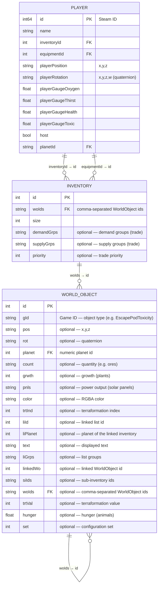

# Planet Crafter — Save file format

> ❗Docs written by AI from save file analysis (proofread, but still can include mistakes)

---
**JSON Schemas** : each section has a validation schema in [`packages/shared-save-processing/schemas/`](../packages/shared-save-processing/schemas/), and validation applies every one of the ten, entry by entry. The world objects section is no exception, although it reaches validation as a generator: its entries meet their schema one at a time as the section is walked, so a save of any size only ever holds one world object in memory.
The root schema [`save-file.schema.json`](../packages/shared-save-processing/schemas/save-file.schema.json) validates a fully parsed save (array of 11 sections, indexes 0 to 10).

## General structure

A save file is a raw text string split into **11 sections** (indexes 0 to 10) separated by `@`. Each section is a list of JSON objects
separated by `|\n`.
The file ends with `@`.

```
<section 0>@<section 1>@...@<section 10>@
```

> ⚠️ **Backward compatibility:** an earlier version of the save format also had a Terrain Layers section (index 9,
> shifting World Events to index 10), which a game update removed. Legacy saves in that older format are only
> supported at the user-input boundary (loading a save file): they are automatically adapted to the current
> 11-section format described below, discarding the Terrain Layers data, and a warning is reported to the user.
> Validation detects the adaptation and is the single source of that warning, on every outcome and in every flow
> (displaying a save, merging saves, `bun validate`, `bun merge`). The warning travels as the code defined in
> `packages/shared-save-processing/normalizeRawSections.js` and is turned into the sentence shown to the user by
> `packages/core-mapping/src/presentation/formatSaveWarning.ts`.

```
entry1|
entry2|
entry3
```

A section is read line by line, and a line that is not valid JSON is **reported and located**, never ignored:
`packages/shared-save-processing/parseSaveSections.js` is the single reader of this format and reports
`{detail, section, entryIndex}` for every line it could not read, keeping the readable entries around it.
Validation turns those reports into located errors (`bun validate` exits 1 and names the section and the entry
position), and merging refuses to write a save whose input carries one. Blank sections stay silent: each section is
trimmed first, which covers the reserved part the terminating `@` produces and the line break the game writes before
the first entry of a section.

---

## Entity Relationship Diagram

(Mermaid format)



---

## Sections details

### #0 — Player Progression (tokens & unlocked groups)

**Cardinality:** 1 unique entry.

| Property                 | Type     | Description                                      |
|--------------------------|----------|--------------------------------------------------|
| `terraTokens`            | `int`    | Current terraformation tokens                    |
| `allTimeTerraTokens`     | `int`    | Total tokens earned since the beginning          |
| `unlockedGroups`         | `string` | Comma separated list of unlocked research groups |
| `openedInstanceSeed`     | `int`    | Open dungeon instance seed (0 = none)            |
| `openedInstanceTimeLeft` | `int`    | Remaining instance time (seconds)                |

---

### #1 — Terraformation Levels

**Cardinality:** N entries (one per planet). Domain key: `planetId`.

| Property                | Type     | Description                                    |
|-------------------------|----------|------------------------------------------------|
| `planetId`              | `string` | Planet textual id (e.g. `"Toxicity"`)          |
| `unitOxygenLevel`       | `float`  | Oxygen level                                   |
| `unitHeatLevel`         | `float`  | Heat level                                     |
| `unitPressureLevel`     | `float`  | Pressure level                                 |
| `unitPlantsLevel`       | `float`  | Plants level                                   |
| `unitInsectsLevel`      | `float`  | Insects level                                  |
| `unitAnimalsLevel`      | `float`  | Animals level                                  |
| `unitPurificationLevel` | `float`  | Purification level (-1 if not Toxicity planet) |

---

### #2 — Players

**Cardinality:** N entries (one by player). Domain key: `id` + `name` (unique).

| Property            | Type     | Description                                            |
|---------------------|----------|--------------------------------------------------------|
| `id`                | `int64`  | Steam ID of the player (primary key)                   |
| `name`              | `string` | Steam Name of the player (deduplication key)           |
| `inventoryId`       | `int`    | → `Inventory.id` (section 4) — inventory of the player |
| `equipmentId`       | `int`    | → `Inventory.id` (section 4) — equipment of the player |
| `playerPosition`    | `string` | 3D Position `"x,y,z"`                                  |
| `playerRotation`    | `string` | Quaternion rotation `"x,y,z,w"`                        |
| `playerGaugeOxygen` | `float`  | Oxygen level (gauge)                                   |
| `playerGaugeThirst` | `float`  | Thirst level                                           |
| `playerGaugeHealth` | `float`  | Health level                                           |
| `playerGaugeToxic`  | `float`  | Toximeter (lower = better)                             |
| `host`              | `bool`   | `true` if the player is the host                       |
| `planetId`          | `string` | Player's current planet                                |
| `cameraView`        | `int`    | Camera view mode                                       |
| `totalCraftedObjects` | `int`  | Total objects crafted by the player                    |
| `totalTerraTokenEarned` | `int` | Total terra tokens earned by the player                |

---

### #3 — World Objects

**Cardinality:** N entries (buildings, resources, plants…). Domain key: `id`.

All properties except `id` and `gId` are optional depending on object type. `id` and `gId` are the only two
carried by every entry of the ten reference saves (190338 world objects); the next most frequent, `pos` and
`planet`, are on 14.31% of them.

| Property   | Type     | Description                                                                                 |
|------------|----------|---------------------------------------------------------------------------------------------|
| `id`       | `int`    | Unique object ID                                                                            |
| `gId`      | `string` | Game ID — object type (e.g. `"WindTurbineT1"`)                                              |
| `pos`      | `string` | 3D position `"x,y,z"` — an object that holds one also names its `planet`                     |
| `rot`      | `string` | Quaternion rotation `"x,y,z,w"`                                                             |
| `planet`   | `int`    | Planet numeric ID, of either sign (e.g. `-1140328421` for Prime, `110910045` for Toxicity)  |
| `count`    | `string` | Amount or cumulative state (e.g. ores in a vein `"0,125"`)                                  |
| `grwth`    | `int`    | Growth progression (plants)                                                                 |
| `pnls`     | `string` | Produced power (solar panels, generators)                                                   |
| `color`    | `string` | RGBA color of object                                                                        |
| `trtInd`   | `int`    | Associated terraformation stage index                                                       |
| `liId`     | `int`    | Linked list id (logistics / drones)                                                         |
| `liPlanet` | `int`    | Planet numeric ID of the linked inventory `liId`, not the planet the object stands on       |
| `text`     | `string` | Displayed text (signs, panels)                                                              |
| `liGrps`   | `string` | Comma separated list of associated object types (item generation, blueprint)                |
| `linkedWo` | `int`    | → `WorldObject.id` — associated world object (e.g. toxic water generator ↔ associated lake) |
| `siIds`    | `string` | Comma separated list of generated items (e.g. beans generated by a farm)                    |
| `woIds`    | `string` | → `WorldObject.id` — comma separated ids of the world objects held (see `GR-ID-3`)          |
| `trtVal`   | `int`    | Terraformation contribution value — an object that holds one also names its `trtInd`        |
| `hunger`   | `float`  | Animal hunger, from `-100` to `100`                                                         |
| `set`      | `int`    | Equipment set identifier                                                                    |

**What the reference saves say about the rarest three:** `liPlanet` appears 21 times, every time on an
`InterplanetaryExchangePlatform1` and every time naming a planet other than the object's own — an exchange
platform points at an inventory sitting on another planet. `hunger` appears 345 times, on entries of `gId`
`DNASequence` only, between `-100` and `94.22`; the bounds the schema states are the symmetric scale the game
is assumed to work on (an animal yields a DNA sequence while its hunger is positive) rather than a documented
range, and the first legitimate save they reject lifts them. `woIds` is on no world object of the ten saves,
but the merge remaps it (`GR-ID-3`), so the schema declares it rather than reject a save the merge handles.

**Planet numeric IDs:** `planet` (here) as well as `WorldEvent.planet` (see below) reference a planet using a
numeric ID rather than the textual `planetId` used elsewhere (`TerraformationLevel.planetId`,
`Player.planetId`, `SaveConfiguration.planetId`). This numeric ID is **stable across saves** (not derived from
the save's world seed or content) — confirmed by cross-referencing several real save files:

| Numeric `planet` ID | Planet name (`planetId`) |
|--------------------:|--------------------------|
|       `-1140328421` | `Prime`                  |
|         `110910045` | `Toxicity`               |
|       `-1016990411` | `Selenea`                |
|        `-486276833` | `Humble`                 |
|       `-1291310150` | `Aqualis`                |

No known deterministic hash function (crc32, fnv1a, djb2, sdbm, Java-style `hashCode`, …) reproduces these IDs
from the planet name, so this table is currently maintained as a fixed lookup rather than computed.

---

### #4 — Inventories & equipment

**Cardinality:** N entries. Domain key: `id`.

Inventory may be referenced by `Player.inventoryId`, by `Player.equipmentId`, or by a `WorldObject` (buildings, machines…).

| Property     | Type     | Description                                                     |
|--------------|----------|-----------------------------------------------------------------|
| `id`         | `int`    | Unique id of the inventory                                      |
| `woIds`      | `string` | Comma separated list of `WorldObject` contained (`""` if empty) |
| `size`       | `int`    | Maximum capacity of the inventory                               |
| `demandGrps` | `string` | (optional) Demand groups for auto-trade (drones)                |
| `supplyGrps` | `string` | (optional) Supply groups for auto-trade (drones)                |
| `priority`   | `int`    | (optional) Logistics priority (drones)                          |

---

### #5 — Statistics

**Cardinality:** 1 unique entry.

| Property            | Type  | Description                       |
|---------------------|-------|-----------------------------------|
| `craftedObjects`    | `int` | Total objects crafted since start |
| `totalSaveFileLoad` | `int` | Number of save file loads         |
| `totalSaveFileTime` | `int` | Total recorded playtime (seconds) |

---

### #6 — Mailbox

**Cardinality:** N entries. Domain key: `stringId`.

| Property   | Type     | Description                                  |
|------------|----------|----------------------------------------------|
| `stringId` | `string` | Unique id of the message (deduplication key) |
| `isRead`   | `bool`   | `true` if message has been read              |

---

### #7 — Triggered Story Events

**Cardinality:** N entries. Domain key: `stringId`.

| Property   | Type     | Description                            |
|------------|----------|----------------------------------------|
| `stringId` | `string` | Unique id of the triggered story event |

---

### #8 — Save configuration

**Cardinality:** 1 unique entry.

| Property                                  | Type     | Description                                           |
|-------------------------------------------|----------|-------------------------------------------------------|
| `saveDisplayName`                         | `string` | Name displayed in slot list                           |
| `planetId`                                | `string` | Host planet for the save (where the game started)     |
| `unlockedSpaceTrading`                    | `bool`   | Cheat - if enabled, unlocks space trading from start  |
| `unlockedOreExtrators`                    | `bool`   | Cheat - if enabled, unlocks ore extractors from start |
| `unlockedTeleporters`                     | `bool`   | Cheat - if enabled, unlocks teleporters from start    |
| `unlockedDrones`                          | `bool`   | Cheat - if enabled, unlocks drones from start         |
| `unlockedAutocrafter`                     | `bool`   | Cheat - if enabled, unlocks autocrafters from start   |
| `unlockedEverything`                      | `bool`   | Cheat - if enabled, unlocks everything from start     |
| `freeCraft`                               | `bool`   | Cheat - if enabled, crafts don't require resources    |
| `preInterplanetarySave`                   | `bool`   | Save created before interplanetary system             |
| `randomizeMineables`                      | `bool`   | Randomized mineable resources                         |
| `modifierTerraformationPace`              | `float`  | Terraformation speed multiplier                       |
| `modifierPowerConsumption`                | `float`  | Power consumption speed multiplier                    |
| `modifierGaugeDrain`                      | `float`  | Gauge drain speed multiplier                          |
| `modifierMeteoOccurence`                  | `float`  | Weather events frequency multiplier                   |
| `modifierMultiplayerTerraformationFactor` | `float`  | Multiplayer terraformation speed factor               |
| `modded`                                  | `bool`   | If true, this game was altered by mods                |
| `version`                                 | `string` | Game version                                          |
| `mode`                                    | `string` | Game mode (e.g. `"Standard"`)                         |
| `dyingConsequencesLabel`                  | `string` | Death consequences (e.g. `"DropSomeItems"`)           |
| `startLocationLabel`                      | `string` | Game start location label (e.g. `"Standard"`)         |
| `worldSeed`                               | `int`    | World seed                                            |
| `hasPlayedIntro`                          | `bool`   | Intro has been played                                 |
| `gameStartLocation`                       | `string` | Game start location                                   |

---

### #9 — World Events

**Cardinality:** N entries (can be empty). Domain key: `planet` + `seed` + `pos`.

| Property            | Type     | Description                                         |
|---------------------|----------|-----------------------------------------------------|
| `planet`            | `int`    | Planet numeric ID                                   |
| `seed`              | `int`    | Event seed                                          |
| `pos`               | `string` | 3D position `"x,y,z"`                               |
| `owner`             | `int`    | Event owner (0 = world)                             |
| `index`             | `int`    | Event index                                         |
| `rot`               | `string` | 3D rotation `"x,y,z,w"`                             |
| `wrecksWOGenerated` | `bool`   | True if wrecks already generated                    |
| `woIdsGenerated`    | `string` | Comma separated list of generated world objects ids |
| `woIdsDropped`      | `string` | Comma separated list of dropped world objects ids   |
| `version`           | `int`    | Event version                                       |

---

### #10 — (Unknown)

**Cardinality:** 0 entries in analyzed save files.

Section 10 is the last section (index 10 of 11). It is always empty in analyzed save files.

---

## Cross-Section Relationship Map (Summary)

```
Section 2 (Player)
  └─ inventoryId ──────────────────────┐
  └─ equipmentId ──────────────────────┤
                                        ▼
                               Section 4 (Inventory)
                                  └─ woIds ──────────┐
                                                      ▼
                                           Section 3 (WorldObject)
                                              └─ linkedWo ──► Section 3 (WorldObject)
```

---

## Appendix — Legacy format (before the Terrain Layers section was removed)

Saves created before a game update had **12 sections** (indexes 0 to 11): sections 0 to 8 were identical to the
current format, but section 9 was **Terrain Layers**, World Events was at index 10, and the reserved empty section
was at index 11.

| Property          | Type     | Description                                   |
|-------------------|----------|-----------------------------------------------|
| `layerId`         | `string` | Id of the layer (e.g. `"PC-Toxicity-Layer2"`) |
| `planet`          | `int`    | Planet numeric ID                             |
| `colorBase`       | `string` | Base color as `"R-G-B-A"`                     |
| `colorCustom`     | `string` | Custom color as `"R-G-B-A"`                   |
| `colorBaseLerp`   | `int`    | Base color intensity (≥ 0)                    |
| `colorCustomLerp` | `int`    | Custom color intensity (≥ 0)                  |

This section no longer exists in the current save format. When a legacy save is loaded or merged, its Terrain Layers
data is discarded and the user is warned that their save was adapted from an old format.

