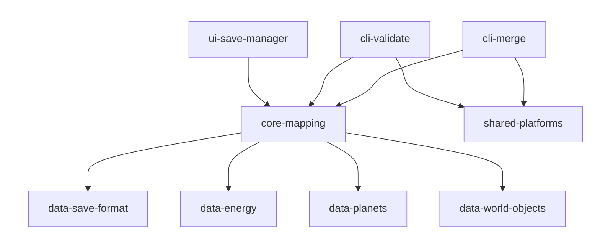
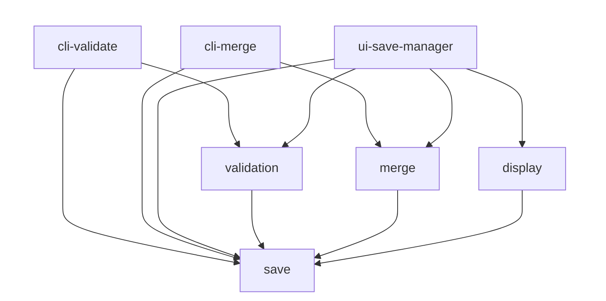
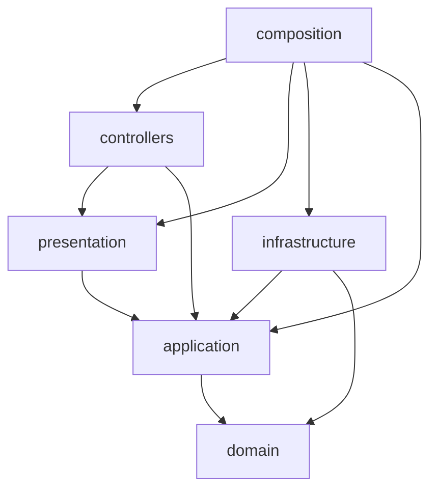

# Dependency graphs

Edges are the imports found in the production sources (specs, `testing/`, e2e and test setup files excluded), measured at `ed1a757`, the commit that dissolved `shared-save-processing` into `core-mapping`, on the branch `refactor/dissolve-shared-save-processing`. The figures are compared with `a286f6a`, the commit this page was measured at before, which laid `core-mapping` out by business. An arrow `A --> B` reads "A imports B". Each package, each area and each layer is one block.

The edges and every count of this page were measured by a one-off script, not versioned, that reads each import statement of the tracked production sources with `readImportStatements` of `scripts/readImportStatements.ts`: value, type-only, re-export, dynamic and JSDoc `@import` statements, one count per statement. Run on `a286f6a`, the same script gives back every figure published there. What an import carries (a request type, a constructor injection, what a guard accepts) was established by reading the files the script names. The counts given as "before wave 14" were measured at `c81d99f`.

## Packages

## Areas of `core-mapping`

The three applications are drawn above the areas whose exports they import.

## Layers of `core-mapping`

Each block gathers one layer of the four areas. An import between two areas within one layer, such as `merge/domain/` importing `save/domain/`, stays inside its block and is not drawn: it is counted in the last table of this page.

An area holds the layers it needs and no other. Production files per area and layer:

| Area          | `domain` | `application` | `infrastructure` | `presentation` | `controllers` | `composition` |
|---------------|----------|---------------|------------------|----------------|---------------|---------------|
| `validation/` | 0        | 5             | 0                | 4              | 2             | 2             |
| `merge/`      | 26       | 12            | 2                | 5              | 2             | 2             |
| `display/`    | 28       | 30            | 6                | 36             | 6             | 2             |
| `save/`       | 34       | 11            | 49               | 12             | 1             | 0             |

`save/infrastructure/` counts 49 files against 16 at `a286f6a`: 30 of them are the wire format modules of `wireFormat/`, the records, parser, serializer and generated section validators `shared-save-processing` held.

## Reading against Clean Architecture

### Packages: no violation

- `shared-save-processing` is gone: its modules live under `core-mapping/src/save/infrastructure/wireFormat/`, `core-mapping` being the only package whose production sources imported it. The 27 imports `core-mapping` made of it at `a286f6a` are now imports inside the package, and the one `shared-save-processing` made of `data-save-format` is now `core-mapping --> data-save-format`, 3 imports against 2.
- Arrows go from `cli-*` and `ui-*` to `core-*`, then `shared-*` and `data-*`, as the matrix of `docs/wiki/architecture.md` sets.
- No interface reaches the save format but through `core-mapping`, whose manifest exports its composition roots and view models only. `check:dependencies` holds it on the production sources of a `cli-*` or `ui-*` package, which import a `core-*` package and, for a CLI, `shared-platforms`, nothing else; the specs of a CLI read the saves `generate:scenario-fixtures` writes, and build none.
- No cycle and no upward arrow.

### Areas of `core-mapping`: no violation

- Every arrow between areas ends at `save`: `validation --> save` 31 imports, `merge --> save` 71, `display --> save` 46, against 30, 68 and 40 at `a286f6a`. Each use case now imports the `UseCase` contract of `save/application/`, 8 imports, and the infrastructure of `merge/` reaches the wire format modules of `save/` for the serializer and the `.json` extension predicate, 2 imports that went to `shared-save-processing` before. No business imports another, and `save` imports no business; `check:business-boundaries` holds both, spec files and `testing/` included.
- Each application imports the composition root of each business it calls, and the view models it renders: `cli-validate` the composition root and `SaveFileValidationViewModel` of `validation/`, `cli-merge` the composition root and `MergeResultViewModel` of `merge/`, `ui-save-manager` the three composition roots, eight view models of `display/` and `MergeResultViewModel`. From `save/`, the three import `SaveValidationMessageViewModel` only.

### Layers of `core-mapping`: no violation

Closed by wave 14, and still closed:

- `controllers --> composition`: 9 imports before wave 14, 0 since. A use case factory is injected into each controller through its constructor, and the composition root of its business instantiates the controller. Nothing inside `core-mapping` imports `composition`; the applications do, through the composition root of each business.
- `presentation --> domain`: 14 imports before wave 14, 0 since. The presenters receive application responses.

Conforming:

- `composition` is the outermost block: it imports every layer it wires and is imported by no file of the package. Each composition root also imports the adapters of `save/infrastructure/` it wires, the parser, validator and game releases reader for `validation/` and `merge/`, the parser and game releases reader for `display/`, which is why `composition --> infrastructure` counts 15 imports, as at `a286f6a`.
- `controllers --> presentation`: 9 imports, each of a ViewModel type of the controller's own business. No controller imports a concrete presenter.
- `controllers --> application`: 9 request types and the `UseCase` contract, imported by the `UseCaseFactory` of `save/controllers/`.
- `presentation --> application`: 32 imports of responses, 9 of presenter ports.
- `infrastructure --> application` (18 imports, against 17) and `infrastructure --> domain` (45, against 43): the adapters implement the ports. `WorldObjectLabelsReaderService` now returns `WorldObjectLabelsResponse`, and the save warnings found while parsing are mapped onto `SaveWarning` of `save/domain/validation/` by `mapSaveWarning` and `validateSaveContent`.
- `application --> domain`: 41 imports, against 39 at `a286f6a`; `LoadConfigurationPage` calls `assessDroneLogistics`, and `LoadEnergyLevelsSection` calls `isPowerConsumptionModified` and reads `gameDefaultModifier` where it read `powerConsumptionModifier`. The application depends on the domain only.
- `domain` has no arrow to another layer; its imports outside its own area all go to `save/domain/`.

### What the graphs do not show, measured

| Blind spot                                            | At `ed1a757`                                                                                                                                                                         | At `a286f6a`                             |
|-------------------------------------------------------|--------------------------------------------------------------------------------------------------------------------------------------------------------------------------------------|------------------------------------------|
| Third-party imports in `core-mapping`                 | 0 in every area and layer; `ajv` is imported by `scripts/generate-section-validators.ts` of the package, 2 imports outside `src/`, and by no production file                          | 0                                        |
| Workspace packages imported by `core-mapping`         | 8 imports, all of a `data-*` package and under an `infrastructure/` folder: 5 in `display/`, 3 in `save/`                                                                            | 34, all under `infrastructure/`          |
| JSON tables imported outside `infrastructure/`        | 0                                                                                                                                                                                    | 0                                        |
| Domain types in a presenter port                      | 0 import from `domain/` in an `application/ports/*Presenter*` file; the 13 imports from `domain/` under `application/ports/` are in reader, mapper and serializer ports              | 0 in a presenter port, 13 in other ports |
| Domain types in a Response                            | 5 imports in 3 responses (`SaveSectionLocation` twice, `SaveSections`, `ValidationIssue`, `SaveWarning`); `check:presentation` refuses `domain/entities/` only and accepts them        | 5 imports in 3 responses                 |
| `controllers --> composition`: static or injected     | no static import; injection through the constructor                                                                                                                                  | the same                                 |
| Imports between two areas within one layer, not drawn | 121, all to `save/`: `domain` 46, `presentation` 32, `application` 29 (8 of them the `UseCase` contract), `controllers` 9 (the `UseCaseFactory` contract), `infrastructure` 5          | 111                                      |

The whole `@CHECKLIST.architecture_review` was not replayed: this reading covers the dependency rule, not the responsibilities of each layer.
