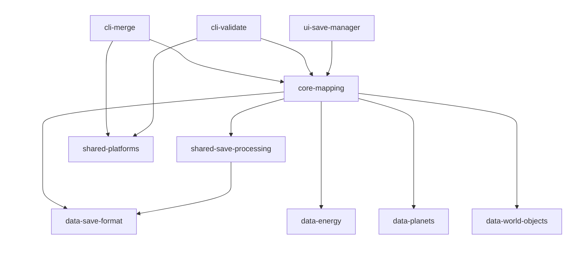
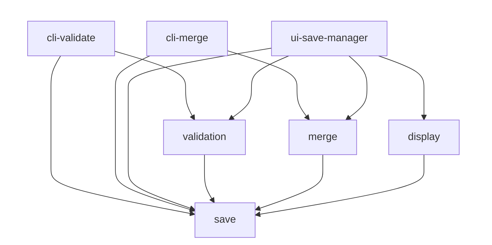
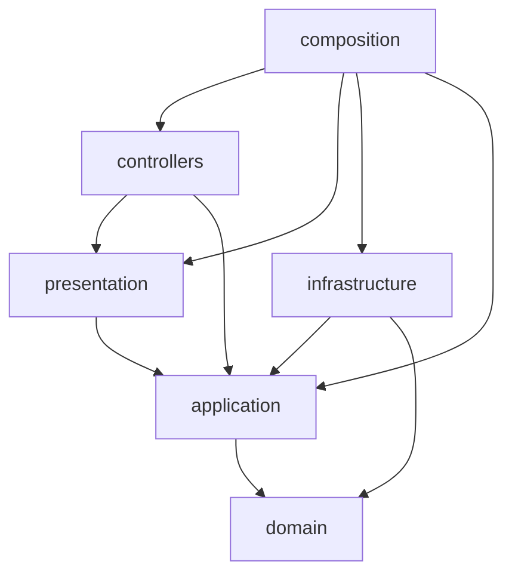

# Dependency graphs

Edges are the imports found in the production sources (specs, `testing/`, e2e and test setup files excluded), measured at `a286f6a`, the commit that laid `core-mapping` out by business, on the branch `refactor/core-mapping-business-folders`; the one edge removed since is named under [Packages: no violation](#packages-no-violation). An arrow `A --> B` reads "A imports B". Each package, each area and each layer is one block.

The edges and every count of this page were measured by a one-off script, not versioned, that reads each import statement of the tracked production sources with `readImportStatements` of `scripts/readImportStatements.ts`: value, type-only, re-export, dynamic and JSDoc `@import` statements, one count per statement. Run on `054b4e0`, the commit this page was measured at before, after wave 14, the same script gives back the figures published there, but one: the page counted 0 imports from `domain/` under `application/ports/`, where the script counts 13, none of them in a presenter port. What an import carries (a request type, a constructor injection, what a guard accepts) was established by reading the files the script names. The counts given as "before wave 14" were measured at `c81d99f`.

## Packages

## Areas of `core-mapping`

The three applications are drawn above the areas whose exports they import.

## Layers of `core-mapping`

Each block gathers one layer of the four areas. An import between two areas within one layer, such as `merge/domain/` importing `save/domain/`, stays inside its block and is not drawn: it is counted in the last table of this page.

An area holds the layers it needs and no other. Production files per area and layer:

| Area          | `domain` | `application` | `infrastructure` | `presentation` | `controllers` | `composition` |
|---------------|----------|---------------|------------------|----------------|---------------|---------------|
| `validation/` | 0        | 5             | 0                | 4              | 2             | 2             |
| `merge/`      | 26       | 12            | 2                | 5              | 1             | 2             |
| `display/`    | 26       | 30            | 6                | 36             | 6             | 2             |
| `save/`       | 34       | 11            | 16               | 12             | 1             | 0             |

## Reading against Clean Architecture

### Packages: no violation

- The edges are those measured at `054b4e0` and at `a286f6a`, less one: laying `core-mapping` out by business changed no import between packages, and `cli-merge --> shared-save-processing`, the one import of a file name predicate both commits counted, was removed afterwards on the same branch, `cli-merge` now filtering the `.json` files of a folder with a predicate of its own.
- Arrows go from `cli-*` and `ui-*` to `core-*`, then `shared-*`, then `util-*` and `data-*`, as the matrix of `docs/wiki/architecture.md` sets.
- No interface has an arrow to `shared-save-processing`: each reaches the save format through `core-mapping`. `check:dependencies` holds it on the production sources of a `cli-*` or `ui-*` package, which import a `core-*` package and, for a CLI, `shared-platforms`, nothing else.
- No cycle and no upward arrow.

### Areas of `core-mapping`: no violation

- Every arrow between areas ends at `save`: `validation --> save` 30 imports, `merge --> save` 68, `display --> save` 40. No business imports another, and `save` imports no business; `check:business-boundaries` holds both, spec files and `testing/` included.
- Each application imports the composition root of each business it calls, and the view models it renders: `cli-validate` the composition root and `SaveFileValidationViewModel` of `validation/`, `cli-merge` the composition root and `MergeResultViewModel` of `merge/`, `ui-save-manager` the three composition roots, eight view models of `display/` and `MergeResultViewModel`. From `save/`, the three import `SaveValidationMessageViewModel` only.
- At `054b4e0`, the three applications reached every business through one composition root, `core-mapping/composition/compositionRoot`.

### Layers of `core-mapping`: no violation

Closed by wave 14, and still closed:

- `controllers --> composition`: 9 imports before wave 14, 0 at `054b4e0` and at `a286f6a`. A use case factory is injected into each controller through its constructor, and the composition root of its business instantiates the controller. Nothing inside `core-mapping` imports `composition`; the applications do, through the composition root of each business.
- `presentation --> domain`: 14 imports before wave 14, 0 since. The presenters receive application responses.

Conforming:

- `composition` is the outermost block: it imports every layer it wires and is imported by no file of the package. Each composition root also imports the adapters of `save/infrastructure/` it wires, the parser, validator and game releases reader for `validation/` and `merge/`, the parser and game releases reader for `display/`, which is why `composition --> infrastructure` counts 15 imports, against 10 at `054b4e0`.
- `controllers --> presentation`: 9 imports, each of a ViewModel type of the controller's own business. No controller imports a concrete presenter.
- `controllers --> application`: 9 request types and the `UseCase` contract, imported by the `UseCaseFactory` of `save/controllers/`.
- `presentation --> application`: 32 imports of responses, 9 of presenter ports.
- `infrastructure --> application` (17 imports) and `infrastructure --> domain` (43): the adapters implement the ports.
- `application --> domain`: 39 imports, against 38 at `054b4e0`; `ValidateSaveFile` and `MergeSaveFiles` now both call `checkSaveInvariants` and `collectSaveWarnings` of `save/domain/rules/`. The application depends on the domain only.
- `domain` has no arrow to another layer; its imports outside its own area all go to `save/domain/`.

### What the graphs do not show, measured

| Blind spot                                            | At `a286f6a`                                                                                                                                                               | At `054b4e0`                             |
|-------------------------------------------------------|----------------------------------------------------------------------------------------------------------------------------------------------------------------------------|------------------------------------------|
| Third-party imports in `core-mapping`                 | 0 in every area and layer; `ajv` is imported by no production file of the package                                                                                          | 0                                        |
| Workspace packages imported by `core-mapping`         | 34 imports, all under an `infrastructure/` folder: 27 in `save/`, 5 in `display/`, 2 in `merge/`                                                                           | 34, all under `infrastructure/`          |
| JSON tables imported outside `infrastructure/`        | 0                                                                                                                                                                          | 0                                        |
| Domain types in a presenter port                      | 0 import from `domain/` in an `application/ports/*Presenter*` file; the 13 imports from `domain/` under `application/ports/` are in reader, mapper and serializer ports    | 0 in a presenter port, 13 in other ports |
| Domain types in a Response                            | 5 imports in 3 responses (`UnreadableLine` twice, `SaveSections`, `ValidationIssue`, `SaveWarning`); `check:presentation` refuses `domain/entities/` only and accepts them | 4 imports in 3 responses                 |
| `controllers --> composition`: static or injected     | no static import; injection through the constructor                                                                                                                        | the same                                 |
| Imports between two areas within one layer, not drawn | 111, all to `save/`: `domain` 46, `presentation` 32, `application` 21, `controllers` 9 (the `UseCaseFactory` contract), `infrastructure` 3                                 | no area                                  |

The whole `@CHECKLIST.architecture_review` was not replayed: this reading covers the dependency rule, not the responsibilities of each layer.
