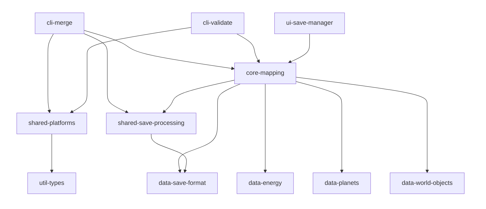
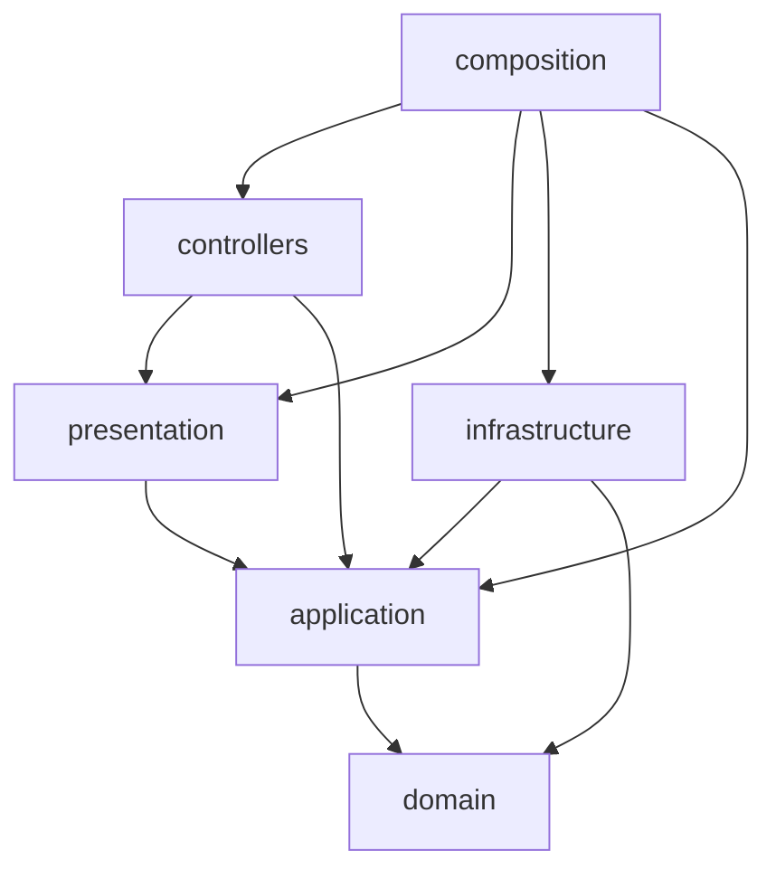

# Dependency graphs

Edges are the imports found in the production sources (specs, `testing/`, e2e and test setup files excluded), measured on `master` at `054b4e0`, after wave 14 and before wave 15. An arrow `A --> B` reads "A imports B". Each package and each folder is one block. The counts given as "before" were measured at `c81d99f`, before wave 14.

## Packages

## Layers of `core-mapping`

## Reading against Clean Architecture

### Packages: no violation

- Arrows go from `cli-*` and `ui-*` to `core-*`, then `shared-*`, then `util-*` and `data-*`, as the matrix of `docs/wiki/architecture.md` sets.
- The four `data-*` packages are new: the value tables left `core-mapping` and `shared-save-processing`.
- No cycle and no upward arrow.

### Layers of `core-mapping`: no violation

Closed by wave 14:

- `controllers --> composition`: 9 imports before, 0 now. The use cases are injected into the controllers, and the composition root instantiates the controllers. Nothing inside `core-mapping` imports `composition`; the three applications do, through the one export `core-mapping/composition/compositionRoot`.
- `presentation --> domain`: 14 imports before, 0 now. The presenters receive application responses.

Conforming:

- `composition` is the outermost block: it imports every layer it wires and is imported by none.
- `controllers --> presentation`: 9 imports, each of a ViewModel type. No controller imports a concrete presenter.
- `controllers --> application`: 9 request types and the `UseCase` contract.
- `presentation --> application`: 32 imports of responses, 9 of presenter ports.
- `infrastructure --> application` and `infrastructure --> domain`: the adapters implement the ports.
- `application --> domain`: the application depends on the domain only.
- `domain` has no outgoing arrow.

### What the graphs do not show, measured

| Blind spot                                             | Measure                                                                                         |
|--------------------------------------------------------|-------------------------------------------------------------------------------------------------|
| Third-party imports in `core-mapping`                  | 0 in every layer; `ajv` is imported by no production file of the package                        |
| Workspace packages imported by `core-mapping`          | 34 imports, all under `infrastructure/`                                                         |
| JSON tables imported outside `infrastructure/`         | 0                                                                                               |
| Domain types in a presenter port                       | 0 import from `domain/` under `application/ports`                                               |
| Domain types in a Response                             | 4 imports in 3 responses (`ValidationIssue`, `UnreadableLine`, `SaveSections`); the `guards` job accepts them |
| `controllers --> composition`: static or injected      | no static import; injection through the constructor                                             |

The whole `@CHECKLIST.architecture_review` was not replayed: this reading covers the dependency rule, not the responsibilities of each layer.
